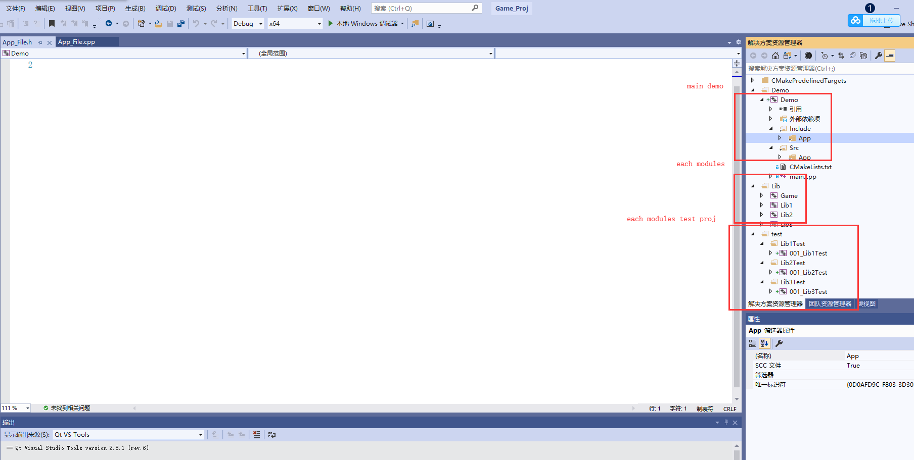

# LearnCMakeStepByStep

Very simple examples to teach you how to use CMake to manage different code modules step by step.

At last,you can manage your code in VSProject has 3 part：

- 1.Main demo code .
- 2.Dependency modules code.
- 3.Dependency modules test code.

## How To Use?
Just click **build_default.bat**,and wait vsproj's generation.
